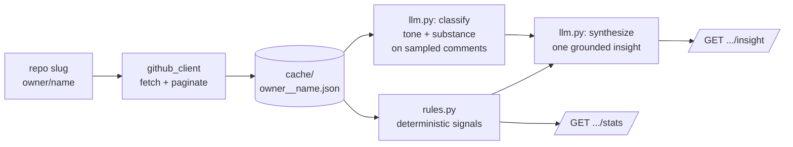

# Review-Insights — Architecture Spec

A backend that ingests a GitHub repo's pull-request review activity, profiles each reviewer's **habits** with deterministic rules, classifies the **meaning** of their comments with an LLM, and surfaces one cross-signal insight they couldn't see on their own.

Scope is deliberately **one repo, not one user globally** — that keeps the data pull bounded, the demo fast, and the "reviewer can run it" constraint trivially satisfied.

---

## 1. Data flow



First run hits the API and writes the cache. Every run after reads the cache. The rule layer never needs the network or the LLM — it's the dependable core. The LLM sits in exactly two places: per-comment classification, and final synthesis.

---

## 2. The three GitHub endpoints (don't conflate these)

This is the part people get wrong. A PR's review activity lives across **three separate REST endpoints**, and they mean different things:

| What you want | Endpoint | Gives you |
|---|---|---|
| **Review verdicts** (the summary-level event: APPROVED / CHANGES_REQUESTED / COMMENTED / DISMISSED, plus an optional body) | `GET /repos/{owner}/{repo}/pulls/{n}/reviews` | `state`, `body`, `user`, `submitted_at`, `commit_id` |
| **Inline code comments** (anchored to a specific diff line — "this variable name is bad") | `GET /repos/{owner}/{repo}/pulls/{n}/comments` | `body`, `path`, `line`, `diff_hunk`, `created_at`, `in_reply_to_id`, `user` |
| **PR conversation comments** (general discussion, not tied to a line — because PRs are issues underneath) | `GET /repos/{owner}/{repo}/issues/{n}/comments` | `body`, `created_at`, `user` |

Note `{n}` is the same number for all three (a PR's number == its issue number).

**Why all three matter for habits:** the *reviews* endpoint gives you the verdict mix and review latency; the *pull comments* endpoint gives you the line-level nitpicking and `suggestion` blocks (the substance of review style); the *issue comments* endpoint catches the "LGTM, thanks" / back-and-forth that isn't anchored to code. Miss any one and your profile is skewed.

### Getting the PR list
```
GET /repos/{owner}/{repo}/pulls?state=all&per_page=100&page={N}
```
`state=all` is essential — most review history lives in **merged/closed** PRs, not open ones. Each PR object gives you `number` and `created_at` (you need `created_at` for the latency signal).

### Pagination + rate limits
- Paginate with `?per_page=100&page=N` until you get a short page.
- **Authenticated = 5,000 req/hr; unauthenticated = 60.** Generate a classic PAT (no scopes needed for public repos), put it in `.env`, send `Authorization: Bearer <token>`. Two-minute setup, saves you a wall.
- **Bound the work:** cap at the most recent ~150–200 PRs. For each, you fetch reviews + pull-comments (+ optionally issue-comments). ~150 PRs × ~3 calls ≈ 450 requests — comfortable within the authenticated budget, and it's a one-time cost because you cache.
- *Optimization if you have time:* the repo-wide bulk endpoints `GET /repos/{owner}/{repo}/pulls/comments` and `GET /repos/{owner}/{repo}/issues/comments` return all comments across the repo in paginated bulk (fewer calls). The catch: there's **no repo-wide reviews endpoint** — review verdicts must be fetched per-PR. So even with bulk comments, you still loop PRs for `/reviews`. For a 24h build, the bounded per-PR loop is simpler and correct; mention bulk as a "what I'd optimize next."

### Filter bots before counting anything
GitHub user objects carry `"type": "Bot"`, and bot logins end in `[bot]` (dependabot[bot], etc.). Drop these in ingest — otherwise your stats are dominated by automation noise and the LLM wastes tokens on `"Bumps lodash from 4.17.20..."`.

---

## 3. The rule / LLM split

The whole assignment hinges on **both layers being load-bearing.** Here's the division that makes neither one optional.

### Rule layer (`rules.py`) — deterministic, no LLM, fully unit-testable
Per reviewer, compute:

- **review_count**, **prs_touched**
- **first_review_latency** — median hours from PR `created_at` → that reviewer's first `submitted_at` on PRs they reviewed. *(Caveat to note in README: `created_at` is a proxy; the precise signal would use the review-request timeline event. Stating this shows rigor.)*
- **verdict_mix** — % approved / changes_requested / commented
- **comments_per_pr**
- **comment_length** — median word count + distribution
- **nit_ratio** — fraction matching `^\s*nit\b` or containing "nitpick"
- **suggestion_usage** — fraction containing a ```` ```suggestion ```` block
- **question_ratio** — fraction containing `?` (cheap proxy for asking vs asserting)
- **temporal** — hour-of-day histogram, weekday vs weekend split
- **language_affinity** — bucketed from comment `path` extensions
- **thread_style** — `in_reply_to_id` presence → one-and-done vs back-and-forth

These are facts. They must never be LLM-guessed.

### LLM layer (`llm.py`) — what rules genuinely cannot do
**(a) Classify** each comment in a *sampled* subset (see staging below):
- `tone`: mentoring | blunt | neutral | encouraging | pedantic
- `substance`: nit_style | naming | logic_bug | architecture | test_coverage | question | praise
- `teaches_why`: boolean — does it explain the reasoning, or just assert?

**(b) Synthesize** the final insight from the aggregated rule stats + the classified distribution.

### Token staging (do this — it reads as maturity)
Don't send every comment to the LLM. A busy reviewer has hundreds.
1. Rules aggregate first.
2. Sample ~30–50 comments per reviewer, **stratified**: include the longest few, all nit-flagged ones, all question ones, plus a random sample of the rest. This guarantees coverage of the range instead of 50 rubber-stamp "LGTM"s.
3. Classify that batch.
4. One synthesis call per reviewer.

---

## 4. The insight (the "couldn't see on their own" payoff)

A dashboard of stats is not the assignment. The deliverable is **one sentence built on a cross-signal correlation** — the thing no one audits about their own reviewing. Design toward correlations like:

- **latency × substance** — *"You review fast (median 3h to first pass), but 78% of your comments are style nits — your rare architecture comments land almost entirely on weekends, and those are your highest-signal reviews."*
- **verdict × substance** — *"You request changes on 40% of PRs, but 70% of those changes are naming/style, not logic."*
- **tone × teaches_why** — *"You explain your reasoning on logic comments but assert flatly on style ones."*

The synthesis prompt must be **grounded**: pass it the actual numbers, instruct it to build the insight *from* them, cite a stat, and explicitly forbid inventing figures. That's the difference between a real insight and a horoscope.

---

## 5. The system's own API (FastAPI)

Keep it small — 3–4 endpoints. The brief prescribes no count; clean beats sprawling.

| Endpoint | Does |
|---|---|
| `POST /ingest` — body `{ "repo": "owner/name", "max_prs": 150 }` | Fetch (or load cache), filter bots, return a summary (PRs, reviewers, comments found). Synchronous is fine for 24h. |
| `GET /reviewers` | List reviewers found + basic counts. |
| `GET /reviewers/{login}/stats` | Pure rule-layer numbers. Fast, deterministic, **no LLM** — works even with no API key. |
| `GET /reviewers/{login}/insight` | The money endpoint: rule stats + LLM classification + the synthesized insight. |

**Graceful degradation:** if no LLM key is set, `/stats` works fully and `/insight` returns the rule layer with a clear note that the LLM insight is disabled. The system never hard-fails on a missing key — that's a constraint the brief rewards ("if a part is incomplete, document it").

---

## 6. Suggested stack & layout

You've shipped FastAPI three times over — lean on it. `FastAPI + httpx + pydantic`, JSON-file cache (simpler and more reviewer-legible than SQLite for this), Anthropic SDK for the LLM.

```
review-insights/
  README.md
  .env.example            # GITHUB_TOKEN=, ANTHROPIC_API_KEY=
  requirements.txt
  app/
    main.py               # FastAPI app + endpoints
    github_client.py      # fetch, paginate, bot-filter, cache
    rules.py              # deterministic signals
    llm.py                # classify() + synthesize()
    pipeline.py           # ingest → rules → sample → classify → synthesize
    models.py             # pydantic schemas
  cache/
    owner__name.json      # cached raw pulls (gitignored or shipped for token-free demo)
  data/
    fixtures.json         # ~10 hand-labeled comments to verify the classifier
  tests/
    test_rules.py         # deterministic, no network
    test_classifier.py    # runs llm.classify against fixtures
```

**Ship a pre-cached repo** in `cache/` so a reviewer can run the whole thing with zero GitHub token — point them at the cache by default, document the "bring your own repo" path. That single move makes your README run on the first try, which is half the grade.

---

## 7. Pre-flight: pick a good repo

Before committing, eyeball a candidate's comment richness — you need real back-and-forth, not bot noise and rubber-stamp approvals. Quick check on any repo:

```bash
# substantive review comments on recent PRs?
curl -s -H "Authorization: Bearer $GITHUB_TOKEN" \
  "https://api.github.com/repos/OWNER/NAME/pulls/comments?per_page=50" \
  | python -c "import sys,json; d=json.load(sys.stdin); \
print(len(d),'comments'); \
[print('-',c['user']['login'],':',c['body'][:80].replace(chr(10),' ')) for c in d[:15]]"
```

You want a mid-size, actively-reviewed library where maintainers actually discuss things. Giant repos are mostly automation; dead repos give the insight engine nothing. If the printed comments look like real human review, you're good. Switching repos at hour 12 because the data was thin is a bad place to be — spend ten minutes here.

---

## 8. README must-haves (the brief grades these directly)

- **Runs from a clean clone** following the steps verbatim — test this on a fresh checkout.
- **Both layers visibly used** — say in one line where rules end and the LLM begins.
- **An "incomplete / what I'd do next" section** — e.g. precise review-request timing via the timeline API; bulk-endpoint optimization; per-contributor tone comparison; and a one-line ethics note: production would be **opt-in self-insight**, not unprompted analysis of someone's public footprint. Naming the gaps is explicitly rewarded.

### The 200-word note
Pick **one** decision and own the trade-off. Strongest candidates:
- *Scoping to one repo, not one user globally* — traded breadth for a bounded, runnable, fast system.
- *Rules pre-aggregate so the LLM classifies a sample, not everything* — traded exhaustive coverage for cost/latency and a system that degrades gracefully without a key.

Either shows judgment. Write it in your own voice.

---

## Build order (for the clock)

1. `github_client` + cache — get real data on disk. **(don't move on until this is solid)**
2. `rules.py` + `test_rules.py` + `/stats` — a fully working, LLM-free product.
3. `fixtures.json` + `llm.classify` + `test_classifier.py` — verify the classifier *before* trusting it.
4. `synthesize` + `/insight` — the payoff.
5. README, pre-cache the demo repo, the 200-word note.

If you run out of time, you stop after step 2 or 3 with a **working** system and an honest "LLM synthesis is wired but untuned" note — far better than a broken end-to-end. Build it so every stopping point is a shippable point.
